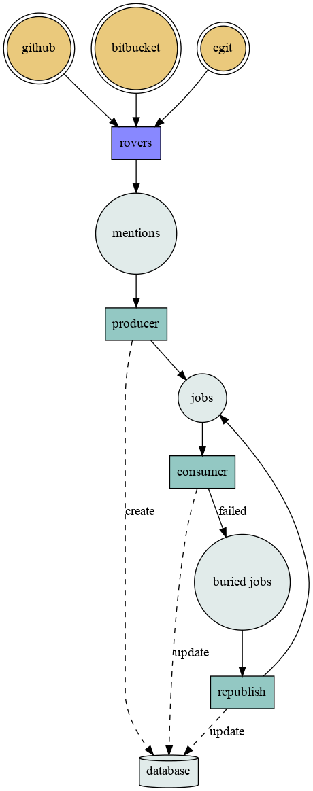
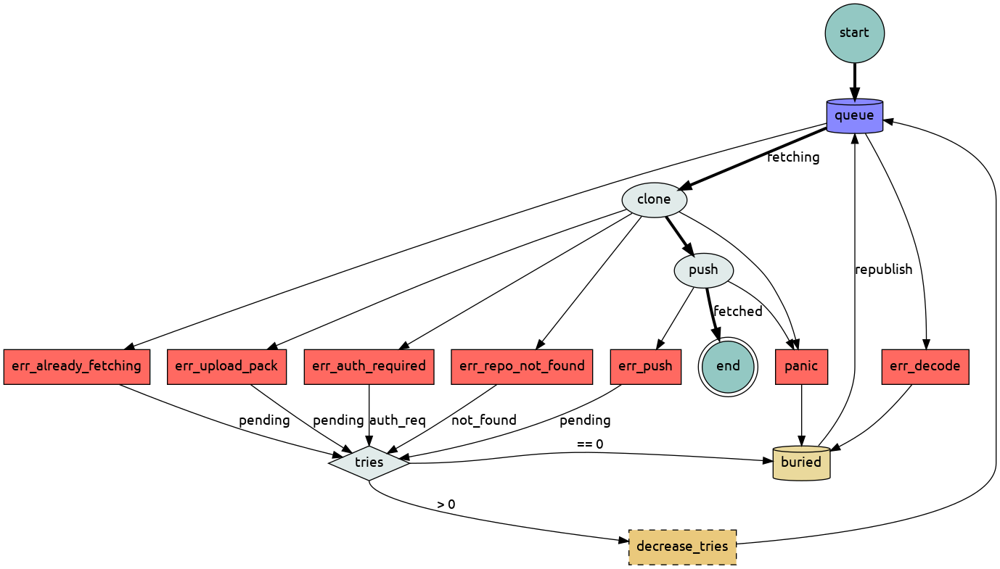

# Workflow

## All components working together

This is an example of several components working together. It's using a producer that generates jobs from the [rovers](https://github.com/src-d/rovers) mentions queue, a consumer that processes those jobs and a republish producer that moves back jobs with errors from buried queue to jobs queue.

## Job states

There are several states for the jobs, these are:

* `pending`: the jobs sits in jobs queue to be picked up
* `fetching`: the jobs is being processed
* `fetched`: job finished processing
* `not_found`: could not find the repo when cloning
* `auth_req`: the repository is not public

The workflow a job follows is (marked with bold lines):

1. Get a job from the job's queue
1. Set its state to `fetching`
1. Clone the repository
1. Push the changes to the rooted repository
1. Set its state to `fetched`

There are several problem that can happen along the way:

* `err_decode`: the job in the queue is malformed and is sent directly to the buried queue
* `panic`: processing the job produces a panic, this also sends the job to the buried queue
* `err_push`: there is a problem in the push phase, its state is set to pending and checks number of retries and sends it back to the job queue if there are retries left or to the buried queue
* `err_repo_not_found`: repository not found while cloning, sets state to `not_found` and sends back to job's queue if there are tries left
* `err_auth_required`: repository is not public, set state to `auth_req` and check retries to send back to queue
* `err_upload_pack`: there was an error cloning the repository, set state to `pending` and do retries check to requeue
* `err_already_fetching`: the job was already in `fetching` state, sets its state to `pending` and check retries to requeue

